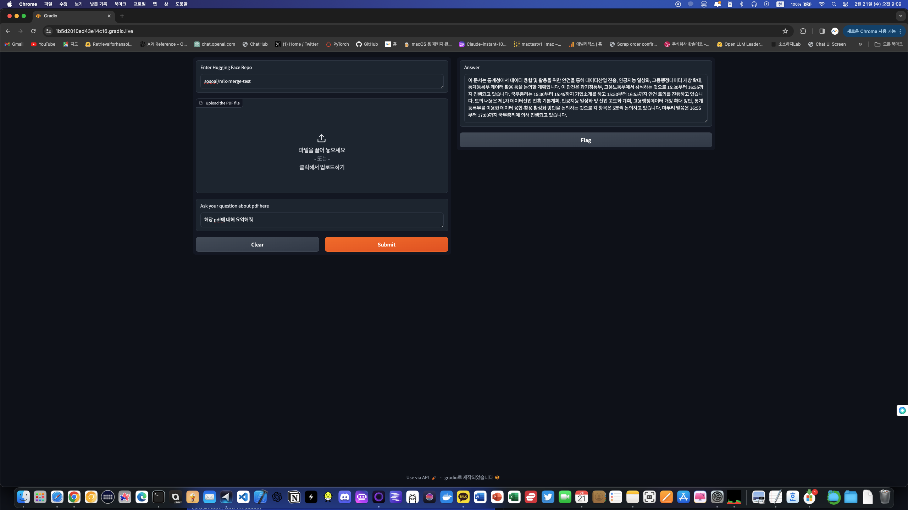
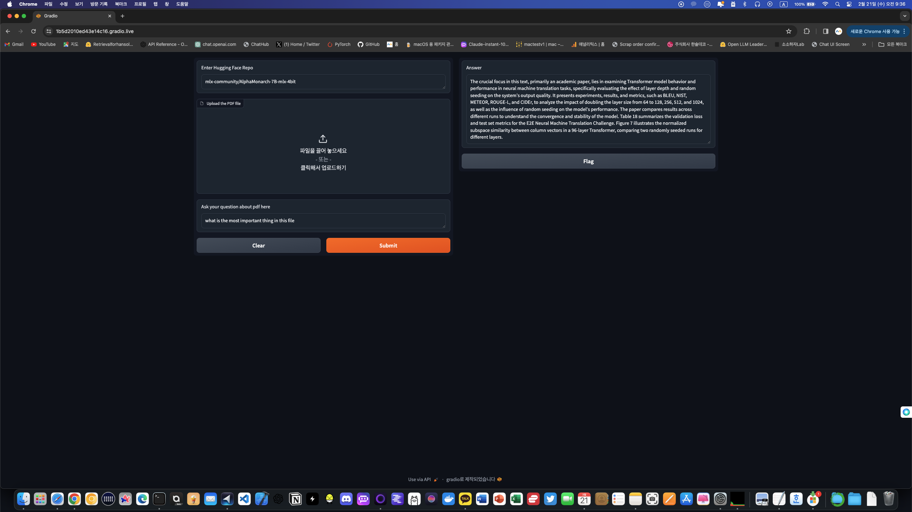

# mlx-rag-gradio

Very simple gradio app for mlx-rag! 

All infomations and dependencies from below repo : 

https://github.com/vegaluisjose/mlx-rag.git

(Really appreciate to mlx contributors and above repo author @vegaluisjose)

Follow the instruction above repo and download this app.py on your local path.

You can directly copy from Huggingface Repo address and paste in "Enter the Hugging Face model repo".

You can copy any repo from HuggingFace (included mlx format) and will be worked automatically from mlx.

recommend to use current version of mlx

```CLI
pip install mlx==0.3.0
```

and others

```CLI
pip install mlx-lm
pip install gradio
```

* This app only support pdf file format for this app.

example video


example screenshot





